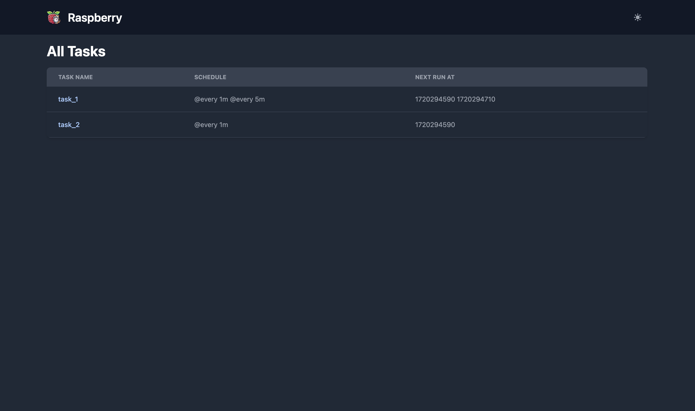
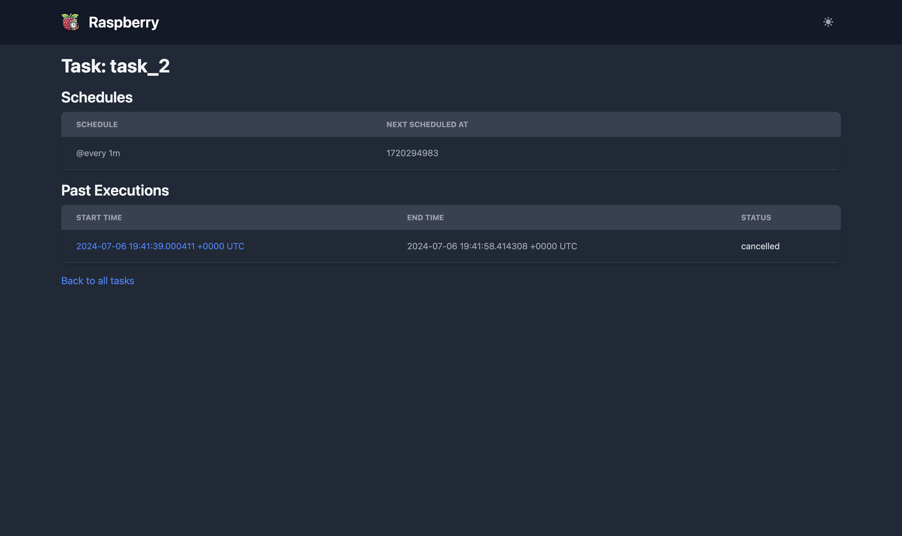
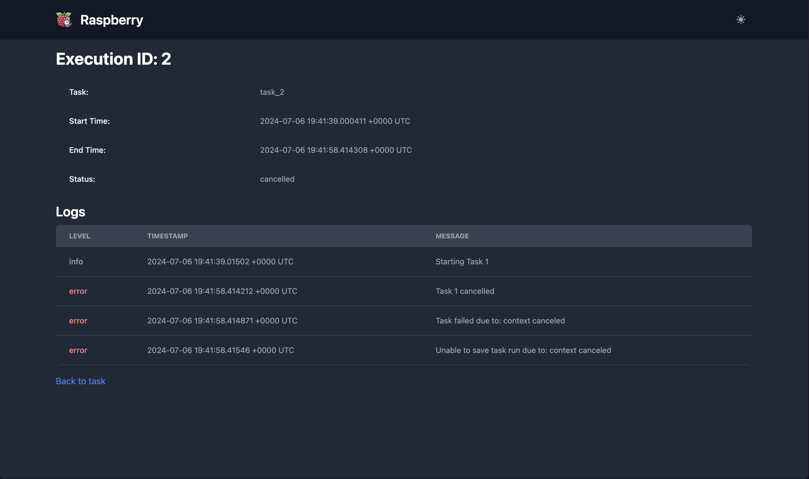
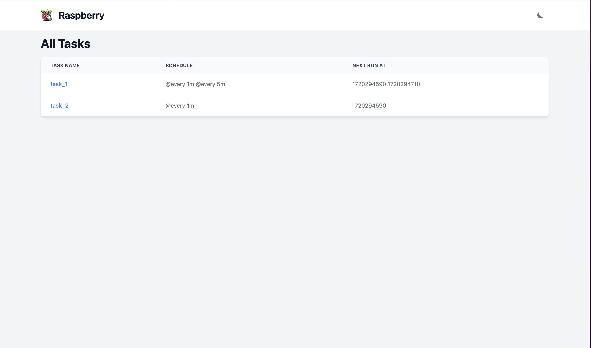

## Raspberry Task Scheduler

Raspberry is a task scheduler with a web GUI and an API, designed to make scheduling and managing tasks easy and efficient.

### Logo


### Features

- Web GUI for task management
- RESTful API for integrating task management into other applications
- Support for common cron intervals and custom cron expressions
- Graceful shutdown handling
- Logging for task execution and status

### GUI
Raspberry offers an wonderful GUI (with both light and dark mode support).

#### Homepage (List all tasks)


#### List all schedules and execution for tasks


#### View a given execution


#### Light Mode


### Installation

To install Raspberry, you need to have Go installed. Use the following command to get the Raspberry module:

```bash
go get github.com/ersauravadhikari/raspberry-go
```

### Getting Started

Below is an example script to demonstrate how to use Raspberry. You can find the full example in the [example/sqlite/main.go](https://github.com/ErSauravAdhikari/raspberry-go/tree/main/example/sqlite/main.go) file.

### Example Usage

#### 1. Define Task Functions

A **task** is a function that will be executed by the scheduler. The function should accept a context, parameters, and a logger.

```go
func task1(ctx context.Context, params map[string]interface{}, logger *rasberry.Logger) error {
    if err := logger.Info("Starting Task 1"); err != nil {
        return err
    }
    select {
    case <-time.After(10 * time.Minute):
        if err := logger.Success("Task 1 completed successfully"); err != nil {
            return err
        }
        return nil
    case <-ctx.Done():
        if err := logger.Error("Task 1 cancelled"); err != nil {
            return err
        }
        return ctx.Err()
    }
}

func task2(ctx context.Context, params map[string]interface{}, logger *rasberry.Logger) error {
    if err := logger.Info("Starting Task 2"); err != nil {
        return err
    }
    select {
    case <-time.After(5 * time.Minute):
        if err := logger.Success("Task 2 completed successfully"); err != nil {
            return err
        }
        return nil
    case <-ctx.Done():
        if err := logger.Error("Task 2 cancelled"); err != nil {
            return err
        }
        return ctx.Err()
    }
}
```

#### 2. Initialize the Raspberry Instance

Set up the Raspberry instance with a database connection.

```go
db, err := store.NewSQLiteDB("task_scheduler.db")
if err != nil {
    log.Fatalf("Failed to initialize SQLite: %v", err)
}
defer db.Close()

rb := rasberry.NewRaspberryInstance(db)
```

#### 3. Register Tasks and Schedules

A **schedule** is a task execution schedule with defined parameters. Register tasks and their schedules with the Raspberry instance.

```go
tsk1 := rb.RegisterTask("task_1", task1)
if err := tsk1.RegisterSchedule(map[string]interface{}{"param1": "value1"}, "@every 1m"); err != nil {
    log.Fatalf("Failed to register schedule: %v", err)
}

tsk2 := rb.RegisterTask("task_2", task2)
if err := tsk2.RegisterSchedule(map[string]interface{}{"param2": "value2"}, rasberry.RunEvery5Minutes); err != nil {
    log.Fatalf("Failed to register schedule: %v", err)
}
if err := tsk2.RegisterSchedule(map[string]interface{}{"param2": "value3"}, rasberry.RunEvery10Minutes); err != nil {
    log.Fatalf("Failed to register schedule: %v", err)
}
```

#### 4. Handle System Signals

Gracefully handle system shutdown signals to ensure all running tasks are completed or cancelled properly.

```go
// Handle system signals for graceful shutdown
sigChan := make(chan os.Signal, 1)
signal.Notify(sigChan, syscall.SIGINT, syscall.SIGTERM)

go func() {
    sig := <-sigChan
    log.Printf("Received signal: %v. Shutting down...", sig)
    rb.Shutdown()
    os.Exit(0)
}()
```

#### 5. Start the Scheduler and API Server

Initialize the task scheduler and start the API server to manage tasks and schedules.

```go
rb.InitTaskScheduler()
rb.RunAPI("8080")
```

### Templated Run Configs

Raspberry provides a set of predefined cron intervals to make scheduling easier:

```go
const (
    // Common cron intervals
    RunEveryMinute    = "@every 1m"
    RunEvery5Minutes  = "@every 5m"
    RunEvery10Minutes = "@every 10m"
    RunEvery15Minutes = "@every 15m"
    RunEvery30Minutes = "@every 30m"
    RunEveryHour      = "@every 1h"
    RunEvery2Hours    = "@every 2h"
    RunEvery3Hours    = "@every 3h"
    RunEvery4Hours    = "@every 4h"
    RunEvery6Hours    = "@every 6h"
    RunEvery12Hours   = "@every 12h"
    RunEveryDay       = "@every 24h"
    RunEveryWeek      = "@every 168h" // 7 * 24 hours

    // Specific time of day (example cron expressions)
    RunAtMidnight = "0 0 * * *"
    RunAtNoon     = "0 12 * * *"
    RunAt6AM      = "0 6 * * *"
    RunAt6PM      = "0 18 * * *"

    // Specific days of the week
    RunEveryMondayAtNoon     = "0 12 * * 1"
    RunEveryFridayAtNoon     = "0 12 * * 5"
    RunEverySundayAtMidnight = "0 0 * * 0"
)
```

Custom cron expressions are also supported.

### API

The API server provides endpoints to manage tasks and schedules. The API documentation is available at `/swagger/index.html`.

#### Endpoints

- **GET /api/tasks**: Get all registered tasks and their schedules.
- **GET /api/task/:name/executions**: Get all executions for a specific task.
- **GET /api/task_run/:id/logs**: Get all logs for a specific task run.
- **POST /api/execution/:id/cancel**: Cancel a specific task execution by ID.

#### Starting the API Server

To start the API server, use the `RunAPI` method provided by the Raspberry instance. This method sets up the necessary routes and starts the server on the specified port.

### Full Example

For a complete example of how to set up and use Raspberry, see the [full example](https://github.com/ErSauravAdhikari/raspberry-go/tree/main/example/sqlite/main.go) in the repository.
